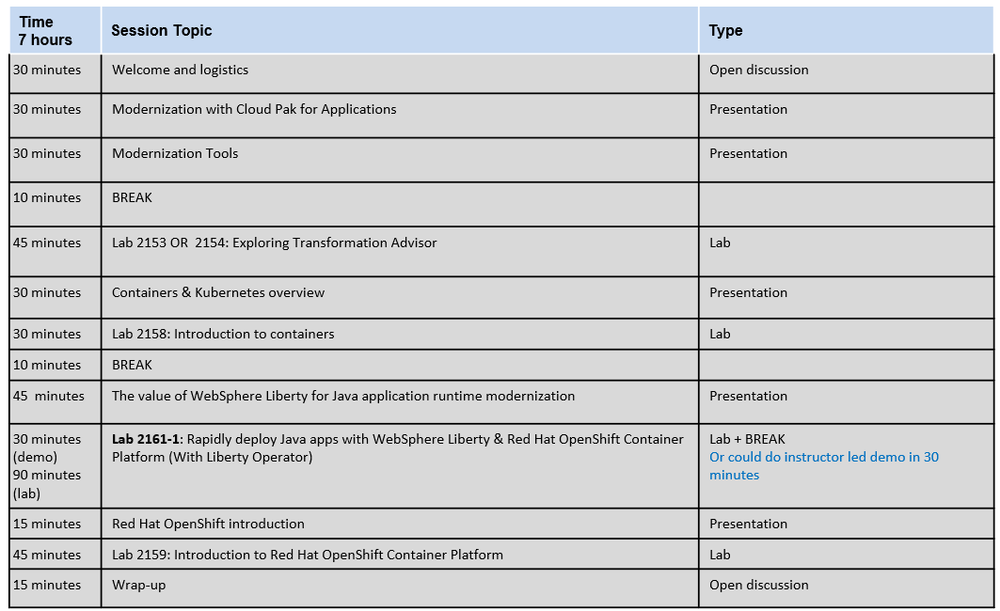

# Liberty Container Deployment on OpenShift PoT)

<!--

-->

**Wednesday, May 8, 2024** 

Time: 9:00 am - 5:00 pm 

This is a 1 day technical workshop.  
  
  - Refer to the **"Workshop labs"** menu item from the left-navigation section to access the lab guides and lab environment. 
  

  
<h3 style="color:black">Proposed Agenda</h3>

<h3 style="color:black">Presentation Material</h3>

[Material shared with attendees](https://ibm.box.com/v/Liberty-containers-POT-share)

<h3 style="color:black">Hands-on Labs</h3>

  - [Workshop Labs](./day1.md)  
  
  
<!-- 
  - [How to access the lab environment](./lab-env.md) 
-->

